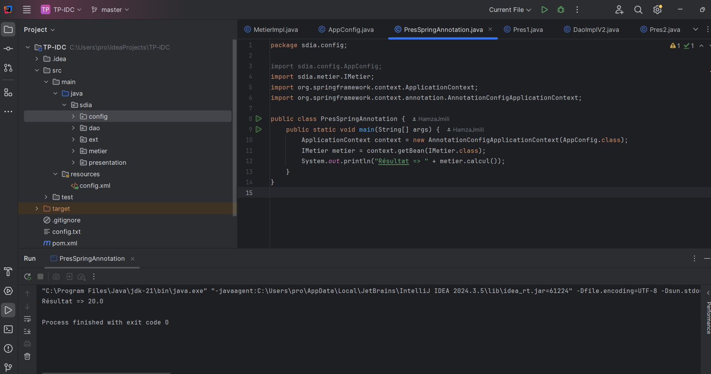

# Injection dépendences-TP1

## 1. Introduction

Ce projet illustre la mise en œuvre d’un petit système distribué en Java, reposant sur le principe d’injection de dépendances (DI) fourni par Spring. L’objectif est de découpler les différentes couches (DAO, métier, présentation) et de gérer dynamiquement leurs dépendances :

- **Via un fichier XML** (`config.xml`)  
- **Via des annotations** (`@Repository`, `@Service`, scan de composants)

---

## 2. Structure du projet

```
src/
├── main/
│   ├── java/
│   │   ├── master/sdia/dao/
│   │   │   └── DaoImpl.java
│   │   ├── master/sdia/ext/
│   │   │   └── DaoImplV2.java
│   │   ├── master/sdia/metier/
│   │   │   └── MetierImpl.java
│   │   └── master/sdia/pres/
│   │       ├── Pres1.java
│   │       ├── Pres2.java
│   │       ├── PresSpringXML.java
│   │       └── Pres2.java
│   └── resources/
│       └── config.xml
└── pom.xml
```

- **`master.sdia.dao`** : DAO « classique » (simulation BD).  
- **`master.sdia.ext`** : DAO alternatif (simulation capteurs).  
- **`master.sdia.metier`** : logique métier consommatrice d’un DAO.  
- **`master.sdia.pres`** : couche de présentation/test, deux modes d’injection.  
- **`resources/config.xml`** : configuration Spring XML.  

---

## 3. Composants clés

### 3.1 Couche DAO

- **`DaoImpl`**  
  – Simule l’accès à une base de données.  
  – Méthode `double getData()` retourne une valeur fixe.

- **`DaoImplV2`**  
  – Simule la récupération de données depuis des capteurs.  
  – Méthode `double getData()` retourne une autre valeur fixe.

### 3.2 Couche Métier

- **`MetierImpl`**  
  – Annoté `@Service` ou défini en XML.  
  – Implémente `double calculate()` qui récupère `getData()` depuis le DAO injecté, puis applique un calcul (ex. multiplication, transformation).

### 3.3 Couche Présentation

- **`PresSpringXML`**  
  – Point d’entrée `main(String[] args)`.  
  – Charge le contexte Spring à partir de `config.xml`.  
  – Récupère le bean métier (`metier`) et affiche le résultat.

- **`Pres2`**  
  – Injection manuelle « à la main » : lecture d’un fichier `config.txt` listant les classes du DAO et du métier.  
  – Utilise réflexivité pour instancier et lier les objets, puis affiche le résultat.

---

## 4. Configuration

### 4.1 Fichier Spring XML (`src/main/resources/config.xml`)

```xml
<beans xmlns="http://www.springframework.org/schema/beans"
       xmlns:xsi="http://www.w3.org/2001/XMLSchema-instance"
       xsi:schemaLocation="
         http://www.springframework.org/schema/beans
         http://www.springframework.org/schema/beans/spring-beans.xsd">

  <!-- DAO alternatif (capteurs) -->
  <bean id="d" class="master.sdia.ext.DaoImplV2"/>

  <!-- Service métier -->
  <bean id="metier" class="master.sdia.metier.MetierImpl">
    <constructor-arg ref="d"/>
  </bean>

</beans>
```

### 4.2 Injection manuelle (`Pres2`)

Créez un fichier `config.txt` à la racine de `resources/` ou du projet :

```
master.sdia.dao.DaoImpl
master.sdia.metier.MetierImpl
```

Le programme `Pres2` lit ces deux lignes, instancie chaque classe, injecte le DAO dans le métier, puis exécute `calculate()`.

---

## 5. Dépendances Maven

```xml
<dependencies>
  <!-- Spring Core / Context / Beans -->
  <dependency>
    <groupId>org.springframework</groupId>
    <artifactId>spring-core</artifactId>
    <version>6.2.5</version>
  </dependency>
  <dependency>
    <groupId>org.springframework</groupId>
    <artifactId>spring-context</artifactId>
    <version>6.2.5</version>
  </dependency>
  <dependency>
    <groupId>org.springframework</groupId>
    <artifactId>spring-beans</artifactId>
    <version>6.2.5</version>
  </dependency>
</dependencies>
```

---

## 6. Exécution

1. **Mode Spring XML (`PresSpringXML`)**
   ```bash
   mvn compile exec:java -Dexec.mainClass=master.sdia.pres.PresSpringXML
   ```
    - Charge `config.xml`
    - Affiche le résultat de `metier.calculate()`.

2. **Mode Injection manuelle (`Pres2`)**
   ```bash
   mvn compile exec:java -Dexec.mainClass=master.sdia.pres.Pres2
   ```
    - Lit `config.txt`
    - Instancie et injecte via réflexivité
    - Affiche le même résultat.

---

## 7. Résultat attendu

Dans les deux modes, la console affiche une valeur numérique calculée, par exemple :

```
Résultat = 22.0
```

---

## 8. Remarques & Extensions

- Démontre l’injection de dépendances **XML vs réflexivité**.
- Peut être étendu pour gérer :
    - Injection par setter ou champ
    - Scanning d’annotations (`@Repository`, `@Service`)
    - Gestion de scopes (`singleton`/`prototype`)
    - Plusieurs implémentations de DAO injectables à chaud

